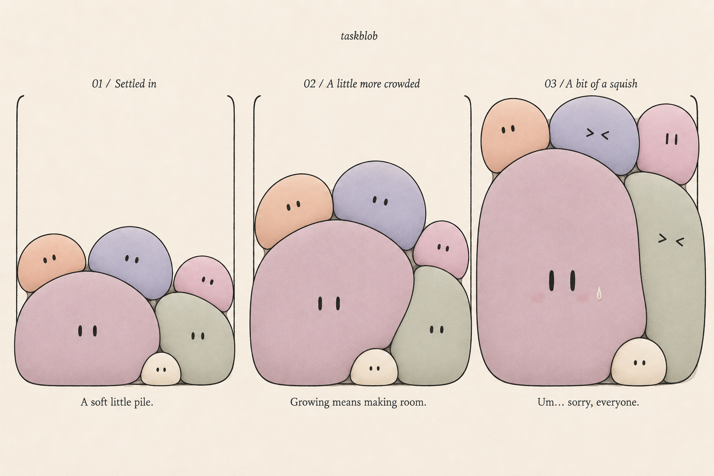

# gnaw roadmap

Status: visual direction selected; physics approved; milestone 3 (the task layer) started. September 7, 2026.

Current progress: a phone-shaped app shell with two tabs. The Jar tab holds real tasks (title, creation time, optional deadline with dd/mm/yyyy and 24h time) saved locally, drawn as creatures whose size and mood follow the task: asleep until due, uncomfortable after, awake and slowly growing without a deadline. Tapping a creature opens a sheet with edit, split (into two or more smaller steps, with confirmation) and set free (with undo), each with its own visual effect. The Playground tab keeps the physics demo with dragging and presets. Fifteen physics tests, eight domain tests and two browser tests pass, along with type checking and production build. Recurrence, export/import, real-phone performance and the native wrapper are not started. See HANDOFF.md.

## North star

The image is the approved visual reference, not a literal physics specification. The existing four-study vanilla JavaScript scaffold predates this direction; it is exploratory work, not the planned architecture or a completed milestone.

gnaw gives unfinished tasks a physical presence. Tasks become creatures in a container: they fall, settle, grow, press against their neighbors, and make room when completed. The appeal is both the visible accumulation and the satisfying release.

### Keep

- Palette B: dusty mauve, faded periwinkle, muted sage, blush, peach, and warm cream; charcoal outlines on warm paper.
- Firm, rounded stress-ball bodies with slight asymmetry. Local flattening at contact, rounded shoulders, and small air pockets. They retain their own shape under pressure.
- Gravity, varied sizes, uneven stacks, actual displacement, and shared contact edges.
- Minimal faces: dots when relaxed, vertical strokes `||` when sheepish, inward squints `><` when compressed. Large overdue creatures can have subtle blush and an occasional sweat drop.
- Faces grow more slowly than bodies and remain legible. Preserve color and identity across growth and recurrence.
- Completion lets the surrounding pile fall and settle into newly available space.

### Avoid

- Slime that fills every gap, tall stretched columns, limbs, detailed anime eyes, and overlapping drawn bodies masquerading as squish.
- Symmetrical piles, floating creatures, uniform sizes, and endless idle bouncing.
- Making every creature grimace. Actual local compression should drive squinting; the oversized creature's sheepishness is a separate expression.

The final image still stretches the green creature more than ideal. The implementation should preserve more of its rounded bulk and displace neighbors upward. Blush and embarrassment timing remain tunable.

## Proposed stack

| Layer | Recommendation | Reason |
| --- | --- | --- |
| App interface | React + TypeScript + Vite | Forms, task details, settings, accessible list, and responsive shell; TypeScript also covers the simulation. |
| Blob drawing | PixiJS, initially WebGL | Dedicated 2D renderer for dynamic contours, eyes, outlines, and restrained texture. WebGPU is optional, not a launch dependency. |
| Physics | Small custom TypeScript soft-body solver, evaluated in a bounded prototype | Our defining behavior needs shape retention, area preservation, deformation, and real contact. Rendering alone does not provide this. |
| Local data | IndexedDB behind a storage interface | Offline task records, completion history, versioned migrations, and export/import. Simulation state is separate. |
| Web delivery | Responsive app, then installable PWA | Validate on desktop and phone browsers before store distribution. |
| Phone apps | Capacitor after the web experience passes device testing | Reuse the web UI and canvas in native iOS/Android containers; add haptics and native reminders through adapters. |
| Verification | Unit tests for domain/physics invariants; Playwright for user flows | Protect calendar behavior, task persistence, input, and simulation stability. Visual feel still needs human review. |

This is a recommendation, not a dependency migration performed by this document.

### Why PixiJS rather than Three.js?

Our chosen art is flat 2D. PixiJS supplies a 2D rendering system with WebGL/WebGPU support. Three.js supplies the foundations of a 3D engine; that becomes useful if we later choose volumetric creatures, perspective, or 3D lighting. Neither choice solves the soft-body contact problem by itself. For this design, I recommend spending complexity on deformation and touch behavior rather than a 3D scene. See [PixiJS introduction](https://pixijs.com/8.x/guides/getting-started/intro) and [Three.js installation overview](https://threejs.org/manual/en/installation.html).

### Physics approach to validate

Start with a small position-based solver, using XPBD-style compliant constraints where useful. XPBD provides a basis for controllable deformable-body stiffness; our 2D blob system would still be a custom implementation and needs validation. [Original XPBD paper](https://matthias-research.github.io/pages/publications/XPBD.pdf).

Represent each blob as a closed boundary with a modest number of vertices, initially around 16–24. Combine edge-length, area, bending, and shape-restoration constraints. Area preservation keeps a pressed blob substantial; shape restoration gives it the firmness of a stress ball. Tune these together rather than forcing a perfectly rigid circle.

Use gravity, damping, fixed simulation steps, capped catch-up after interruptions, and several constraint iterations. Resolve wall and inter-body contacts, including edge contacts; preventing only point collisions can still allow bodies to cross. Guard against self-intersection, inversion, and overly fast dragging. Rendering must not smooth the contour so aggressively that visible outlines overlap despite valid collision geometry.

Grow the target rest shape gradually so neighbors have time to move. Smooth local compression measurements to drive expressions without flickering. Faces follow a stable interior anchor, stay inside their body, and do not stretch with each vertex. Start face scaling with a clamped curve that grows slower than the body's linear size, then tune visually.

This is the highest-risk part of the project. First evaluate 6–12 bodies with minimal rendering. If the custom solver cannot deliver stable, firm contact within this bounded spike, evaluate an existing deformable-body implementation or a simpler constrained model before expanding scope. Any simplified approach must still pass the visual criteria; circle collisions with decorative overlap are insufficient.

### Separation of responsibilities

- Task domain: dates, recurrence, status, size targets, identity. No PixiJS or native APIs.
- Simulation: bodies, constraints, collisions, interaction, compression. No React or database calls.
- Renderer: contours, texture, faces, pointer hit testing. Consumes simulation snapshots.
- App: task forms, list, detail views, settings, accessible controls. Sends commands to the simulation; does not update React state per physics frame.
- Platform adapters: persistence, clock, reminders, haptics, lifecycle. Web first, native implementations later where necessary.

Save task data and optional layout hints; do not serialize every vertex on every frame. On return, calculate elapsed task time and settle toward the new sizes rather than simulating the entire absence. Freeze/sleep settled physics and pause when backgrounded, while allowing occasional inexpensive expression animation.

## Milestones

### 1. Physics playground — next

Build one jar with six colored creatures based on the north star. Add developer controls for spawning, dragging, growing, shrinking/removing, resetting, and adjusting firmness, damping, and gravity. Include the three reference states as reproducible presets.

Done when:

- Bodies drop, squash briefly, and settle without sustained jitter or interpenetration.
- A growing blob lifts and presses neighbors; they retain rounded bulk instead of turning into liquid wedges.
- Removing a supporting blob causes a natural collapse and settlement.
- Both pointer and touch dragging work; a quick drag cannot fling a body through the wall.
- A full jar remains stable. Pressure expressions reflect contact; face scaling is readable.
- A short recorded side-by-side comparison with the north star supports choosing the material feel.

Target 60 fps for 6–12 blobs on a representative phone; record device, resolution, and physics/render timings. This is an acceptance target, not a measured promise. Test resize, extreme growth, repeated drag/release, and background/resume as part of this stage.

### 2. Character and visual polish

Tune silhouettes, outline thickness, palette, subtle paper texture, blinking, face scale, blush, and the `||` / `><` vocabulary. Add a completion shrink/deflate treatment that frees physical space. Consider subtle optional sound later.

Done when the three density presets feel like the same cast, pressure is readable without constant distress, and touch targets remain usable even for small creatures. Support reduced motion with a stable view and accessible actions.

### 3. Useful web MVP

Add task creation/editing, due dates, completion with undo, letting go, weekly recurrence, task details, and an accessible companion list. Persist locally with versioned data and export/import. Retain a clearly marked demo mode for time travel, separate from real task data.

Decide and implement calendar semantics explicitly: selected weekday, local timezone, daylight-saving changes, overdue recurrence, and whether early completion keeps the original cadence. Proposed default: one recurring creature, anchored to its chosen weekday; missed weeks do not create additional creatures. Completing an overdue occurrence advances to the next scheduled future occurrence. Test Sunday watering across a missed week and a clock/timezone change.

Separate task age, deadline urgency, and physical pressure. Proposed size rule: gradual capped growth from an eligible start/due point, with the exact timing decided through use. A future task should not become enormous before it is actionable. Completion/skip resets the relevant occurrence. Size does not claim to represent effort or importance.

Done when tasks survive reload and offline use, recurrence is predictable, undo restores the task, and every task remains reachable through keyboard, screen reader, and list even if its blob is small or crowded.

### 4. Phone-browser beta and PWA

Validate the complete experience on actual iOS and Android browsers. Add installation metadata and offline app-shell caching, with safe update handling. Test safe areas, keyboard opening, portrait/landscape changes, storage failures, and app resume.

Measure performance with 6, 12, and 24 bodies. Decide a visible-body capacity and overflow behavior before shipping. A finite jar cannot preserve unlimited area: proposed behavior is to cap visual growth near capacity and offer another jar or the complete list, without silently hiding tasks. This decision remains open for a hands-on trial.

Use it for a week with real tasks. Evaluate whether people understand which task is which, enjoy completion, and want to return to a crowded jar. Tune expression intensity and offer a gentler setting if needed.

### 5. Native phone beta

Wrap the proven web build with Capacitor and test in native WebViews. Capacitor supports adding a native container and native feature APIs to an existing web project; this makes reuse plausible, not automatic store readiness. [Capacitor documentation](https://capacitorjs.com/docs).

Add optional haptics and scheduled local reminders, request permissions in context, and verify reminders reschedule after edits/completion. Test durable storage and migration, device restore, lifecycle, accessibility, and battery consumption. Plan for access to Apple's build/signing toolchain for iOS, Android tooling, developer accounts, and store-specific release work.

Done when native builds pass real-device acceptance and have a tested data recovery/export path. Store submission is a separate release step.

### 6. Optional expansion after validation

Account and cross-device sync, multiple jars, shared tasks, richer recurrence, themes, and widgets. Choose a backend only when sync is in scope; design stable task IDs and storage interfaces now. Define conflict handling and deletion semantics before adding sync. These are possibilities, not MVP commitments.

## Immediate next deliverable

A small browser physics playground matching `north-star.png`, with drop, drag, grow, and complete controls. The first approval point is the moving material: does it feel like a firm, squishy little creature? Keep the task manager expansion behind that decision.
